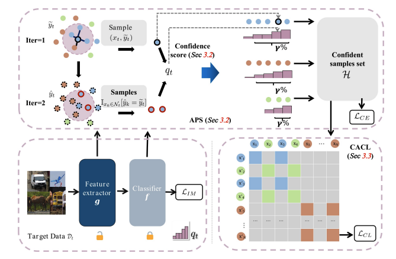

# UPA
This the official implementation for the paper "[Uncertainty-Aware Pseudo-Label Filtering for Source-Free Unsupervised Domain Adaptation](https://arxiv.org/abs/2403.11256)". Accepted to Neurocomputing.

## Framework:


## Usage
Environments and Datasets preparation please refer to [SHOT](https://github.com/tim-learn/SHOT).

### Training

1. Train source models
```sh
    sh source.sh
```  

2. Soure-free domain adaptation in target domains
```sh
    sh run_office.sh/run_office-home.sh/run_visda.sh/run_domainnet126.sh
```

## Citation
If you find this code useful for your research, please cite our papers
```sh
    @article{chen_uncertainty-aware_2024,
	title = {Uncertainty-aware pseudo-label filtering for source-free unsupervised domain adaptation},
	volume = {575},
	issn = {0925-2312},
	pages = {127190},
	journaltitle = {Neurocomputing},
	author = {Chen, Xi and Yang, Haosen and Zhang, Huicong and Yao, Hongxun and Zhu, Xiatian},
	date = {2024},
}
```
